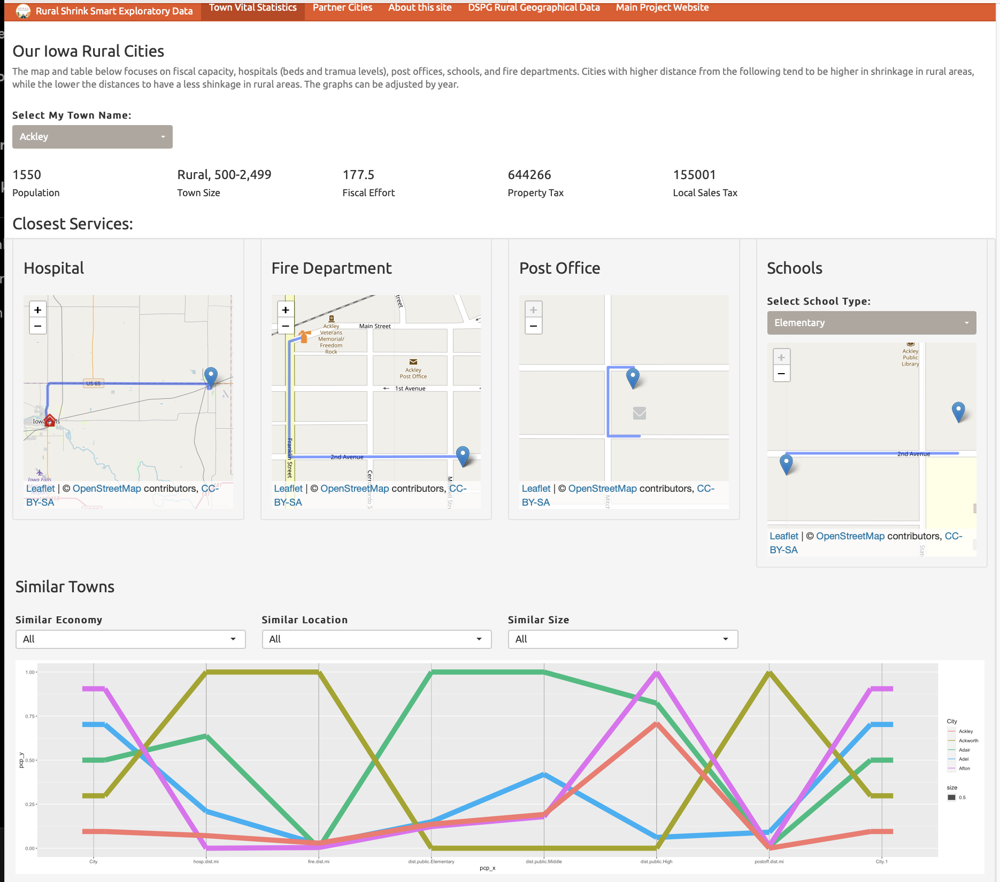

## Project Information

Some communities continue to thrive as they lose population because they adapt and stay focused on quality of life, community services, and investing in the future. This is what we call rural smart shrinkage. 

(https://ruralshrinksmart.org/)

## Motivation
With the amount of publicly open-source data, a proliferation of visualization dashboards has increased in nearly every industry. A dashboard in its fundamental form, a dashboard supports a way of presenting and making sense of complex data to better enable and support decision making. 

## Data Description
Data collected from https://data.iowa.gov were used to create the SCC dashboard. Most of these datasets are collected on a town/city or county level, requiring us to carefully join data accounting for differences in spatial resolution. https://data.iowa.gov contains unique information about residents, including local liquor sales, school building locations, town budgets and expenditures, hospital beds, Medicaid reimbursements, and other details that may provide information about local quality of life.

## Guiding Design Principles

Our initial set of dashboard design principles is as follows: 

- The town leaders are the focus audience (central focus of the app)

- Facilitate comparisons with other towns in order to allow the user to explore other potential solutions

- Present the user with peer comparisons in order to widen the scope of exploration beyond the initial set of obvious peers in the local region.

- Allow for more detailed data and feature requests to improve the dashboard design over time.

## Guided Discovery Learning with Dashboard
We leverage the framework of Guided Discovery Learning (GDL) to guide the town leaders to make discoveries using our interactive visualization. This framework leverages hints, feedback, and other helpful information to guide users in interactive exploration

## Dashboard Visual Iterations

- It should be worth noting that the dashboard design is an iterative process that starts with an idea without limitations of the actual implementation pieces.
- After implementation has been completed and the team notes limitations, we change the interface.
- Now incorporate more literature on dashboard design and user experience, which removes some of the "cool" implementations 

## The Original Mockup 

## Back to the drawing board

## Back to the drawing board... AGAIN

## Dashboard Visual Right Now

