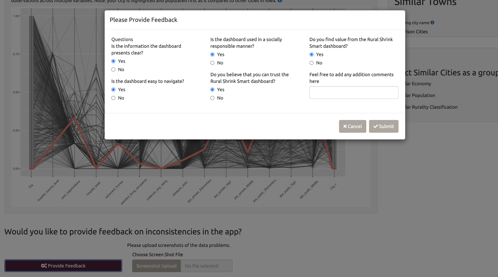
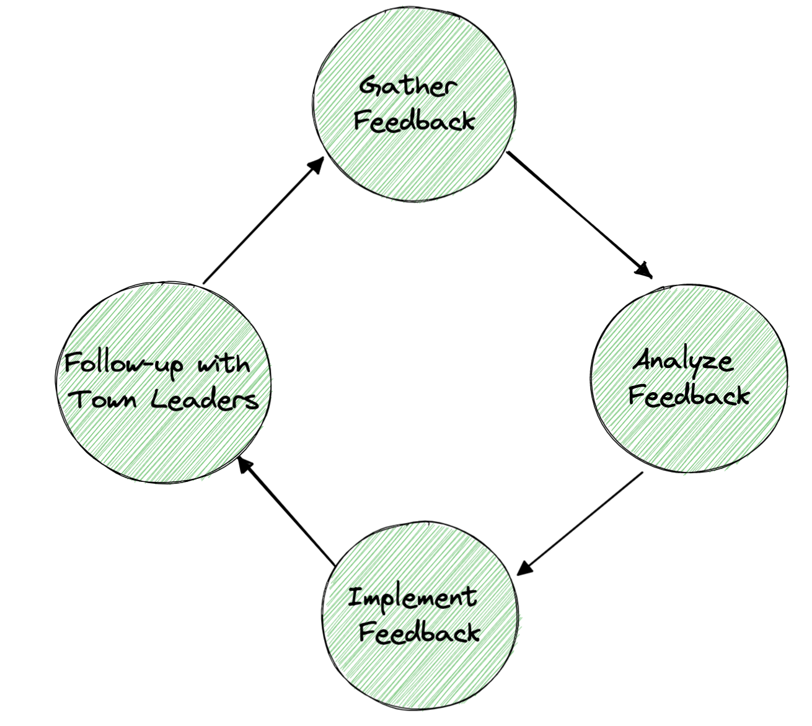

class:title-slide-custom

```{r, child = "style.Rmd"}
```

```{r setup, echo = FALSE, message = FALSE, warning = FALSE}
# Packages
library(emoji)
library(purrr)
library(tidyverse)
library(gridExtra)
library(nullabor)
library(scales)
library(knitr)
library(kableExtra)
library(RefManageR)
library(iconr)
library(fontawesome)
# download_fontawesome()

# References
bib <- ReadBib("bib/references.bib", check = FALSE)
ui <- "- "

# R markdown options
knitr::opts_chunk$set(echo = FALSE, 
                      message = FALSE, 
                      warning = FALSE, 
                      cache = FALSE,
                      dpi = 300)
options(htmltools.dir.version = FALSE)
options(knitr.kable.NA = '')
```

```{r, include = F, eval = T, cache = F}
clean_file_name <- function(x) {
  basename(x) %>% str_remove("\\..*?$") %>% str_remove_all("[^[A-z0-9_]]")
}
img_modal <- function(src, alt = "", id = clean_file_name(src), other = "") {
  
  other_arg <- paste0("'", as.character(other), "'") %>%
    paste(names(other), ., sep = "=") %>%
    paste(collapse = " ")
  
  js <- glue::glue("<script>
        /* Get the modal*/
          var modal{id} = document.getElementById('modal{id}');
        /* Get the image and insert it inside the modal - use its 'alt' text as a caption*/
          var img{id} = document.getElementById('img{id}');
          var modalImg{id} = document.getElementById('imgmodal{id}');
          var captionText{id} = document.getElementById('caption{id}');
          img{id}.onclick = function(){{
            modal{id}.style.display = 'block';
            modalImg{id}.src = this.src;
            captionText{id}.innerHTML = this.alt;
          }}
          /* When the user clicks on the modalImg, close it*/
          modalImg{id}.onclick = function() {{
            modal{id}.style.display = 'none';
          }}
</script>")
  
  html <- glue::glue(
     " <!-- Trigger the Modal -->

<!-- The Modal -->
<div id='modal{id}' class='modal'>
  <!-- Modal Content (The Image) -->
  
  <!-- Modal Caption (Image Text) -->
  <div id='caption{id}' class='modal-caption'></div>
</div>
"
  )
  write(js, file = "js-addins.html", append = T)
  return(html)
}
# Clean the file out at the start of the compilation
write("", file = "js-addins.html")
```

<br><br>
# Exploring Rural Shrink Smart Through Guided Discovery Dashboards
## SDSS 2022
### June 8, 2022
#### Denise Bradford
#### Department of Statistics, University of Nebraska - Lincoln 
##### `r fa("envelope", fill = "black")` [denise.bradford@huskers.unl.edu](denise.bradford@huskers.unl.edu) 
<!-- ##### `r fa("home", fill = "black")` [www.deniserbradford.com](https://www.deniserbradford.com/)  -->
##### `r fa("github", fill = "black")` [drbradford12](https://github.com/drbradford12)

<br><br>
.medium.emph[
Theme designed by Emily A. Robinson [www.emilyarobinson.com](https://www.emilyarobinson.com/)
]
???
Thank you for inviting me for a visit today and for attending my talk.

---
class:primary
# Outline

<br>
.large.emph[
+ Introduction to Rural Shrink Smart Project with Iowa State University

+ Why Dashboards?

+ Dashboard Design and Guided Discovery Learning (GDL)

+ Parallel Coordinate Plots (PCPs) and the naive user

+ Data Collection and Feedback the loop

+ Future Work
]

???
In this talk today, I will provide a background of the Rural Shrink Smart Project. I will then provide a framework to way using a dashboard can be helpful to these population discovery of gaining insights from other towns. I will continue to discuss the usefulness of parallel coordinate plots on the naive user. I will conclude with future work.

---
# Rural Shrink Smart Project
.center[

]

+ <span style="color:darkred"> Project Question:</span> How do some cities manage to maintain quality of life for residents amid shrinking populations?
  + Can this be taught? 
  
.medium.emph[
This material is based upon work supported by the National Science Foundation under Grant No. 1952007. We would also like to thank our collaborators at Iowa State, the Iowa League of Cities, and the various Iowa government organizations which publish their data at (https://data.iowa.gov).
]

---
# Basic Idea

+ Assemble publicly available data sets
    + Available over lots of different geographic measurements    
    Lat/Long, Zip code (5 or 9 digit, changes over time), Address, City, Census units, School District, County
    + May not be complete for small towns    
    (ACS estimates aren't useful in these areas - not enough people surveyed)

+ Assess usability, interpretability and adaptability to new statistical methodology. 

+ .emph.cerulean[The Rural Shrink Smart EDA dashboard incorporates two major components]: 
    + Data Visualization Interface component with Guided Discovery Learning (GDL) principles
    + Exploratory Data Analysis component utilizing statistical graphical elements, such as maps and Parallel Coordinate Plots (PCPs)


---
# Challenges

+ Quality of Life is a subjective assessment
  + Iowa Small Town poll has measured subjective QOL by decade for one small town in each of the 99 counties in Iowa (same town each year)
  + Survey response rates keep decreasing over time

+ There are objective measures of things that contribute to QOL available in public datasets
.medium.emph[
  + School ratings
  + Town budgets for services
  + Access to medical care, shopping, etc.
  + Transportation trends
  + Demographic shifts
  + City level cooperative agreements with other government entities and NGOs
]

---
# Challenges

+ Quality of Life is a subjective assessment
  + Iowa Small Town poll has measured subjective QOL by decade for one small town in each of the 99 counties in Iowa (same town each year)
  + Survey response rates keep decreasing over time

+ There are objective measures of things that contribute to QOL available in public datasets

+ <span style="color:darkred">Project Question:</span> How do we leverage <span style="color:blue">data science</span>  and <span style="color:blue">exploratory data methods</span> to inform town leaders to reduce the shrinkage and maintain reliability?
    + How does an interactive dashboard of open-source data integrate into overall decision-making?
    + Can we focus on estimating only things that objective measurements don't capture?

---
  
# Identifying Key Metrics

<b>Audience</b>

.medium.emph[
+ As small rural towns, traditionally, do not have access:
     + Data scientists 
     + Ability to easily leverage data collected locally to support decisions 

Our research team will provide communities with data about services in small town Iowa in order to assist with developing strategies to improve quality of life for their residents amid shrinking populations 
]
--

<b>Visualization Goals</b>

.medium.emph[
+ Create a central place for the excess of data to be conveyed in a single comprehensive visual.
    + We will utilize Parallel Coordinate Plot (PCPs)
+ Create a map feature that will allow for town leaders to understand the distance of essential QoL components (e.g. Fire Dept, Schools, etc.)
+ Add an overview of town general basics related to the seven QoL factors.
]
--

<b>Engage People</b>

.medium.emph[
+ We will assess our visualizations to determine which strategies for user interface and interactive graphics design are most useful to empower town leaders to make discoveries in publicly available data assembled with a focus on items that impact rural quality of life.
]

---
# Visualization

+ Create a town-focused dashboard that lets leaders see how their town compares to other similar towns (geographically and as measured by the unsupervised statistical analysis)

+ Goal is to help towns see what strategies for maintaining QOL work and don't

+ Emphasis on things towns are empowered to change
    + Can't focus on e.g. agricultural policy
    + City budgets, partnerships with outside entities, services that matter and don't
--

+ How do we best design charts/graphs/UI to make people feel empowered and help them explore the data with an open mind?
    + How do we incorporate statistical analyses into this? Much of the data will provide qualitative differences but not statistically significant differences.
    
---
# Guiding Design Principles

Our initial set of dashboard design principles are: 

+ The town leaders are the focus audience (central focus of the app)
    + Local Map (Local Essential Services)
    + Vital Statistics

+ Facilitate comparisons with other towns in order to allow the user to explore other potential solutions

+ Present the user with peer comparisons in order to widen the scope of exploration beyond the initial set of obvious peers in the local region.
    + PCP to compare the towns with varying similar features (e.g. economy, population, rurality or user input)  

+ Allow for more detailed data and feature requests to improve the dashboard design over time.

---

# Dashboard Design Workflow

+ Compile a single data set
    + rows: Each town
    + columns: Each variable with appropriate spatial aggregation    
    e.g. distance to service instead of lat/long

+ Unsupervised Analysis
    + Which towns are most similar based only on the public data?
 
+ Dashboard Layout
    + Which layout will allow the user to engage the most without overwhelming their curiosity?
   
+ Dashboard Feedback
    + What elements on the dashboard are useful, confusing, misleading or incorrect from town leaders?
    
---
# Dashboard Design Workflow

## Unsupervised Analysis
<br>

- Unsupervised clustering methods were used to determine data quality 

--

<br>
-  During the process, we found that schools, fire departments, post offices and hospitals were missing

--

<br>
-  Resulted in finding other open source datasets that were used for sanity checks along with adding information of missing data
    
???

We found that in towns that the project leaders understood were off. For example, we found that many of the schools that were known to be in the towns were not in the dataset that we were using. Along with the fact that we have the leaflet feature, we could see that schools were in particular parts of towns that we did not see. 

---
# Dashboard Design Workflow (Layout)

## Dashboard Layout Iterations

.large.emph[
+ Version 1: An idea without limitations of the actual implementation pieces.
]

.center[

]

---
# Dashboard Design Workflow (Layout)

## Dashboard Layout Iterations

.large.emph[
+ Version 2: After implementation has been completed and the team notes limitations, we change the interface.
]

.center[

]

---
# Dashboard Design Workflow (Layout)

## Dashboard Layout Iterations

.large.emph[
+ Version 3: Now incorporate more literature on dashboard design and user experience, which removes some of the "cool" implementations 
]

.center[

]

---
# Dashboard Design Workflow (Layout)

## Dashboard Layout Iterations

.large.emph[
+ Version 4: Finally incorporate a collective feedback from team-leaders that suggests lack of understanding of information
]

.center[

]

---
# Dashboard Design Workflow (Layout)

## Dashboard Components 

.large.emph[
+ Map (Town's closest services)
]

--
 <br>
 
.large.emph[
+ Vital Statistics (Town-centric and county level)
]
--
 <br>
 
.large.emph[
+ Parallel Coordinate Plot with objective measures related to the QoL Survey
]

---
# Dashboard Philosophy 

## Reasoning behind using PCP

<br>

.large.emph[
+ We provide users with a town-centric approach: their town is at the center of our application, and comparisons to other, similar towns are secondary. 
]

--
<br>

.large.emph[
+ We allow users to modify a set of suggested comparison towns to indicate other towns of interest.
]
---
class:primary

# Dashboard Philosophy

## PCPs Effectiveness & Novice Users

**Who?** Sukwon Lee, et al. wrote How do People Make Sense of Unfamiliar Visualizations?: A Grounded Model of Novice’s Information Visualization Sensemaking
  
**What?** Propose a grounded model of `NO`vice’s information `VI`sualization `S`ensemaking (`NOVIS` model)
+ Framework for assessing a person's ability to interpret a new graphical map
    + Two Basic Components:
      + Visual Object (textual objects and non-textual objects)
      + Frame (frame of content and frame of visual encoding)

**Why?** Advantages of using NOVIS model includes a reproducible framework of understanding graphics.
<br><br>
[Reference Journal](https://ieeexplore.ieee.org/document/7192668)`r Citep(bib[[c("lee et al")]])`

???

NOVIS Model has been used to compare other graphs such as PCP, Tree Maps and Chord diagrams, which helps with the understanding of why we could use the PCPs. We will use this model to ask questions of our town leaders to gain feedback on what they understand.
---
# Dashboard Philosophy

## PCP in Dashboard Develop Reasoning

<br>
+ The large set of publicly available data we have assembled is useful, but we must be careful with how we present this data because it would be easy to overwhelm the user with small details that mask the bigger picture.

  + A small subset of variables of interest to start with, and then 
  
  + Allow the user to increase the complexity of the display in accordance with their interest 

+ This avoids some of the pitfalls of dashboard design that can easily lead to user overload [Few](https://www.stephen-few.com/) `r Citep(bib[[c("few")]])`  
    
---
class:primary
# Dashboard Philosophy 

## Background of Guided Discovery Learning

**Who?** [Michael A. DeDonno](https://doi.org/10.1016/j.lindif.2016.05.023) wrote The influence of IQ on pure discovery and guided discovery learning of a complex real-world task.
  
**What?** To investigate the predictive ability of IQ on pure discovery and guided discovery learning of a complex real-world task.

**How is this useful?** As mentioned previously, we not only want to present a complex graphic for novice users, we also want to empower the town-leader users to explore the dashboard, comprehensively. We would like to use the general principles by making sure that the users understands what is being presented to them. 

**Experimentation** We will collect how the users are clicking on the app. This will help us understand if the users are getting better understanding of the app over time.


???


---
# Dashboard Philosophy 

## Guided Discovery Learning with Dashboard Design
<br>
We leverage the framework of Guided Discovery Learning (GDL) to guide the town leaders to make discoveries using our interactive visualization. By leveraging:

+ hints

+ feedback

+ other helpful information to guide users in interactive exploration
    e.g. user ignoring the radio buttons to compare similar cities, etc.

---
# Dashboard Design WorkFlow (Feedback)

## User Testing in Beta

**Audience**

+ Groups of Users:
    + Graphics Group Members (Users know Statistical Graphics)
    
    + Rural Shrink Smart Project Members (Users know the project with little background in Statistical Graphics)
    
    + Others (Member of doctoral community that has background in educational adaptivity)

---
# Dashboard Design WorkFlow (Feedback)

## Dashbaord Feedback

+ Our feedback from users has two components:

   + User prompted (using a survey and screenshots)
   
   + User behaviors being record in the background:
   
      + This will help validate issues that are being mentioned in the survey.
      
      + e.g. "I'm having a hard time understanding the PCP information", we will see that users are not spending any time on the PCP.

.center[

]
---
class:primary

# Future Work

+ Continue to incorporate feedback from town leaders.
<br>
.center[

]


---
class:inverse
<br>
<br>
<br>
.center[
# Thank you! 
### Acknowledgments: Dr. Susan VanderPlas and the ISU - Rural Shrink Smart Project Team
<br>
<br>
`r fa("envelope", fill = "white")` **denise.bradford@huskers.unl.edu**
<!-- ##### `r fa("home", fill = "black")` [www.deniserbradford.com](https://www.deniserbradford.com/)  -->
`r fa("github", fill = "black")` **@drbradford12**
]

???

Thank you for the support of my adviser Dr. Susan VanderPlas and the ISU Rural Shrink Smart
